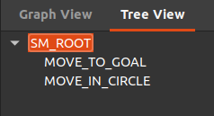

# Smach (State Machine) demonstration
This workspace demonstrates a basic usage of Smach for a mobile base.
It has two functionalities:
1. Move to goal ( in a straight line), when reached or crossed the goal
2. Move in circle.

## Setup
_Create a workspace:_  
`mkdir basic_ws/src`  
_Place the file in the src:_  
`cd basic_ws/src`  
_Make:_ 
`cd ..` 
`catkin_make` 
`source devel/setup.bash` 
_Run the commands:_ 
Launch robot model in gazebo: 
`roslaunch mobile_manipulator_body base_gazebo_control.launch` 
Run the smach file: 
`rosrun mobile_manipulator_body smach_basic.py` 

## Dependencies:
ROS Noetic 
Smach 

## Result: 

 

